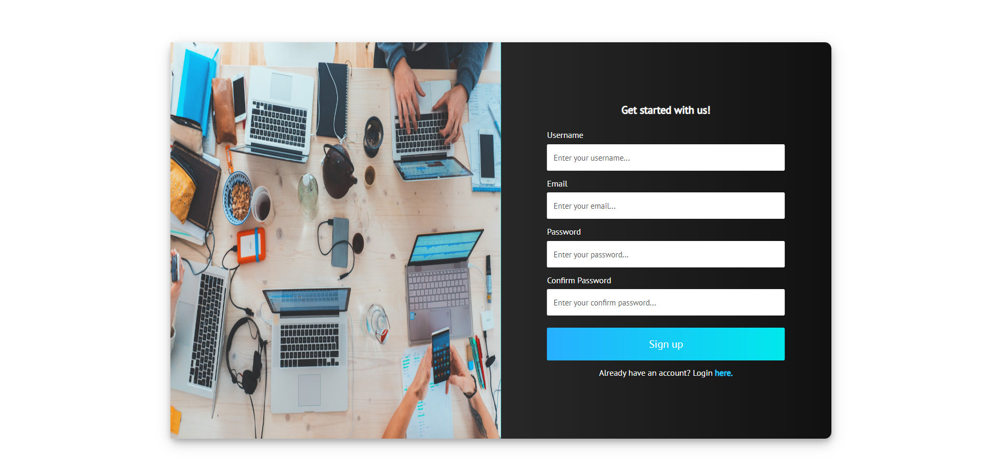

# React Form Validation

> This project was simple React application with a simple form and validations.

## Table of Contents
* [General Info](#general-information)
* [Technologies Used](#technologies-used)
* [Screenshots](#screenshots)
* [Setup](#setup)
* [Project Status](#project-status)
* [Contact](#contact)

## General Information
- This project was a React application with a simple form and validations I created while learning React.

## Technologies Used
- React - version 18.2.

## Screenshots
- Web Screenshot
  
    

## Setup
To run this project, install it locally using npm:

```
$ cd ../react-form-validation
$ npm install
$ npm start
```

## Project Status
Project is: _complete_ .


## Contact
Created by [@ToQuyenPhan](https://www.facebook.com/profile.php?id=100006321400254) - feel free to contact me!
